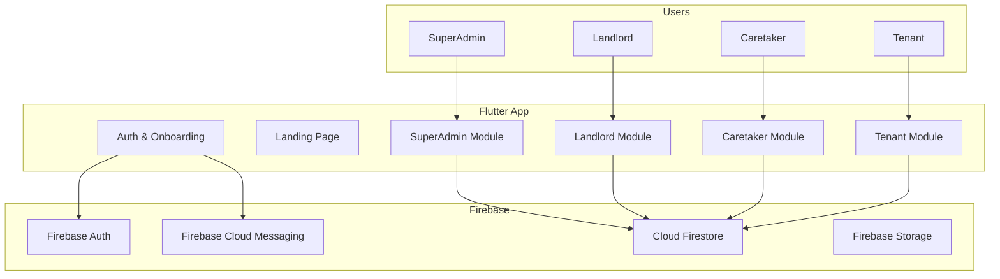
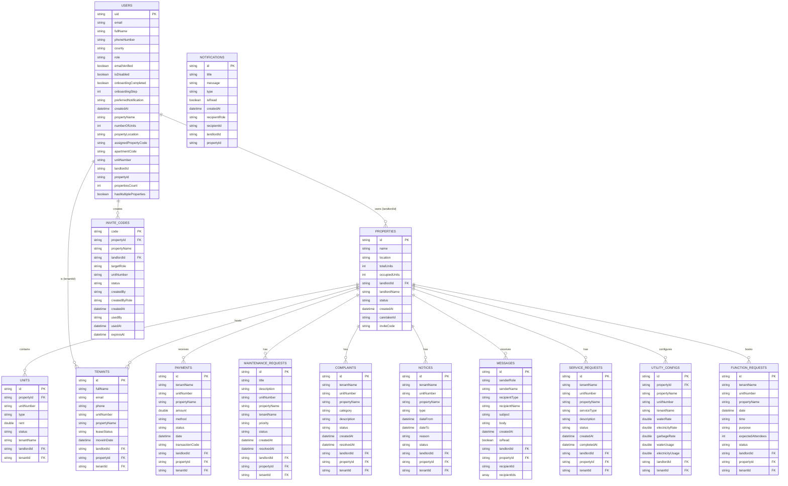
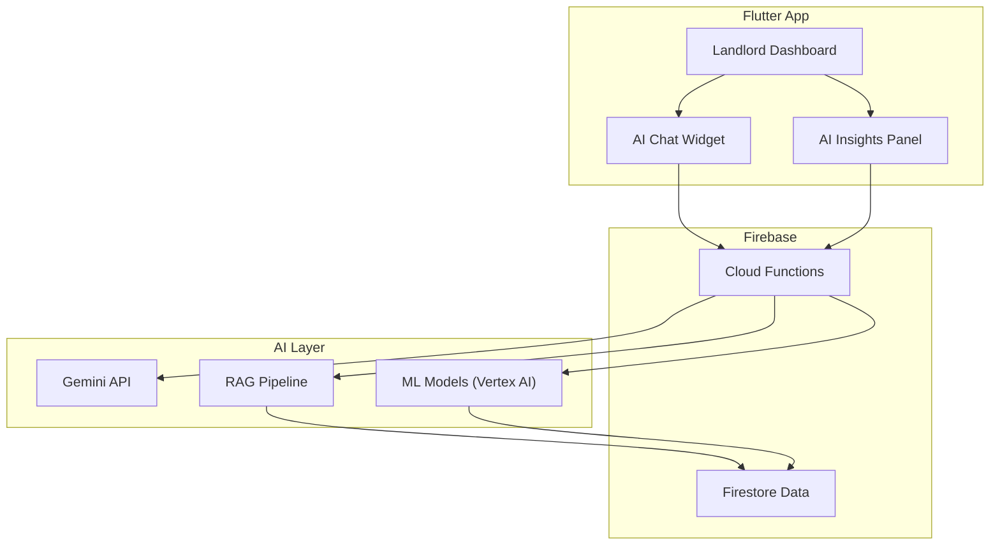
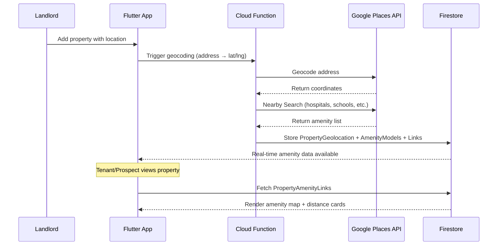
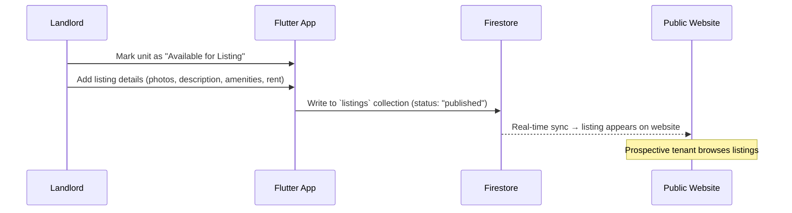
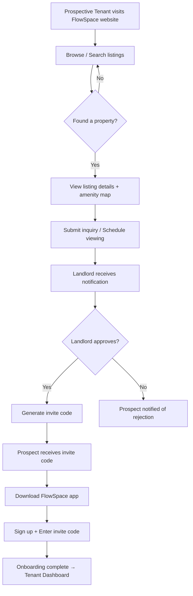

# FlowSpace Rental Management System — Technical Document

> **Version:** 1.0.0 · **Platform:** Flutter (Web, Android, iOS, Desktop) · **Backend:** Firebase (Auth, Firestore, Storage, Messaging)  
> **State Management:** Riverpod · **Routing:** GoRouter · **Architecture:** Feature-first Clean Architecture

---

## 1. System Overview

FlowSpace is a multi-tenant rental management platform serving **four user roles**: SuperAdmin, Landlord, Caretaker, and Tenant. The system uses a feature-first architecture with clean separation between `domain`, `data`, `application`, and `presentation` layers per role. All persistent data flows through Cloud Firestore with real-time `StreamProvider` reactive updates.



---

## 2. Authentication & Onboarding Flow

### 2.1 Auth Screens
| Screen | Features |
|---|---|
| **Sign In** | Email/password login, Google Sign-In, "Forgot Password" link |
| **Sign Up** | Email/password registration, Google Sign-In, email verification trigger |
| **Verify Email** | Polling for email verification status, resend verification email |
| **Forgot Password** | Email-based password reset request |
| **Reset Password** | Deep-link based password reset form |

### 2.2 Onboarding Flow (4 Steps)
| Step | Screen | Description |
|---|---|---|
| 0 | Welcome | Introduction to FlowSpace, proceed to onboarding |
| 1 | Basic Info | Full name, phone number, county selection |
| 2 | Role Selection | Choose: **Landlord**, **Caretaker**, or **Tenant** |
| 3 | Role-Specific Info | Role-dependent fields (see below) |

**Role-Specific Onboarding Fields:**

| Role | Fields Collected |
|---|---|
| **Landlord** | Property name, number of units, property location |
| **Caretaker** | Assigned property code (invite code from landlord) |
| **Tenant** | Apartment code (invite code), unit number |

---

## 3. User Roles & Feature Matrix per Page

### 3.1 Landlord — 14 Navigation Pages

The landlord has the most comprehensive feature set as the property owner/manager.

#### Dashboard (`/landlord/dashboard`)
| Feature | Description |
|---|---|
| KPI Cards (5) | My Properties count, Total Rent Collected, Occupancy Rate %, Pending Maintenance Issues, Open Complaints |
| Financial Overview | Donut chart — Rent Collected vs Outstanding vs KRA Tax (10%); Mini stat cards for Gross Rent, Est. KRA Tax, Net Income |
| Quick Actions (4) | Add Property, Add Tenant, Record Payment, View Tickets |
| Activity Tabs | Tab 1: Recent Payments list (last 5); Tab 2: Maintenance Requests list (last 5) |
| Seed Sample Data | Button to populate Firestore with demo data when no properties exist |

#### Properties (`/landlord/properties`)
| Feature | Description |
|---|---|
| Property List | Searchable list of all properties with name, location, occupancy stats |
| Add Property Dialog | Form: property name, location, total units → writes to `properties` collection and sends SuperAdmin notification |
| Property Actions | View property details (location, occupancy, caretaker assignment) |
| Invite Caretaker | Generate time-limited invite code → stored in `invite_codes` collection; copy to clipboard |

#### Tenants & Caretakers (`/landlord/tenants`)
| Feature | Description |
|---|---|
| Tenant/Caretaker Tabs | Toggle between Tenants list and Caretakers list |
| Tenant List | Searchable, filterable list with name, email, phone, unit, property, lease status, move-in date |
| Onboard Tenant Dialog | Manual tenant registration form (name, email, phone, unit, property selection, move-in date) |
| Invite Tenant | Generate invite code for a specific unit → code stored in `invite_codes` |
| Invite Caretaker | Generate caretaker invite code for a property |
| Account Management | Enable/Disable tenant or caretaker accounts (sets `isDisabled` flag in Firestore) |
| Caretaker List | Stream of `AppUser` documents with `role == 'caretaker'` linked to landlord's properties |

#### Payments (`/landlord/payments`)
| Feature | Description |
|---|---|
| Payment Records | Real-time list of all payments across properties (tenant name, unit, property, amount, method, status, date, transaction code) |

#### Finance Summary (`/landlord/finance`)
| Feature | Description |
|---|---|
| Rates Configuration | Editable KRA income tax rate (%), caretaker salary (flat or % of revenue) |
| Per-Property Breakdown | For each property: gross rent collected, calculated KRA tax, caretaker cost, net revenue |
| Finance Summary Cards | Aggregate gross rent, total tax, total caretaker costs, net portfolio income |
| Expense Tracking | Per-property operating expense summary |

#### Complaints (`/landlord/complaints`)
| Feature | Description |
|---|---|
| Complaints List | Real-time stream of complaints with tenant name, unit, property, category, description, status, timestamps |
| Status Management | Update complaint status (Open → In Progress → Resolved) |

#### Maintenance (`/landlord/maintenance`)
| Feature | Description |
|---|---|
| Maintenance Tickets | Real-time stream of requests with title, description, unit, property, tenant, priority, status, timestamps |
| Status Updates | Change ticket status (Open → In Progress → Resolved/Closed) |

#### Service Requests (`/landlord/service-requests`)
| Feature | Description |
|---|---|
| Service Request List | Stream of service requests (cleaning, laundry, fumigation, etc.) with status tracking |
| Status Management | Approve/deny/complete service requests |

#### Messages (`/landlord/messages`)
| Feature | Description |
|---|---|
| Compose Message | Form with subject, body, recipient type (broadcast to all tenants or individual tenant) |
| Message History | Real-time list of sent messages/announcements with read status |
| Broadcast System | Send announcements to all tenants simultaneously |

#### Utilities (`/landlord/utilities`)
| Feature | Description |
|---|---|
| Property Selector | Dropdown to filter utility configs by property |
| Utility Config List | Per-unit configuration: water rate/usage, electricity rate/usage, garbage flat rate |
| Edit Rates Dialog | Inline editing of all utility rates per unit → writes to `utility_configs` Firestore collection |
| Auto-Calculation | Computed fields: water charge = rate × usage; electricity charge = rate × usage; total = water + electricity + garbage |

#### Notices (`/landlord/notices`)
| Feature | Description |
|---|---|
| Notice List | Real-time stream of tenant notices (move-out, travel) with type, dates, reason, status |
| Status Management | Approve/reject tenant notices |

#### Function Requests (`/landlord/function-requests`)
| Feature | Description |
|---|---|
| Request List | Stream of common-area booking requests with date, time, purpose, expected attendees |
| Approval Workflow | Approve/deny function booking requests |

#### Reports (`/landlord/reports`)
| Feature | Description |
|---|---|
| Report Generation | Create reports by type (Revenue, Occupancy, Maintenance, Utilities) and time period |
| Report List | History of generated reports with title, type, period, generated date |
| PDF Download | Download report as PDF |

#### Settings (`/landlord/settings`)
| Feature | Description |
|---|---|
| Payout Account | Configure M-Pesa Till/Paybill or bank account for rent payouts |
| Automated Invoicing | Monthly invoice rules (generation date, SMS notification toggles) |
| SMS & WhatsApp Notifications | Tenant receipt, payment reminder, maintenance log notification toggles |
| System Alerts | Daily summary updates, overdue rent warnings |

---

### 3.2 Caretaker — 9 Navigation Pages

The caretaker acts as on-the-ground property manager, delegated by the landlord.

#### Dashboard (`/caretaker/dashboard`)
| Feature | Description |
|---|---|
| KPI Cards (4) | Assigned Properties, Managed Units (occupied/vacant), Open Work Orders, Active Complaints |
| Quick Shortcuts (2) | Log Tenant Issue, Inspect Vacancies |
| Active Work Orders | Top 3 maintenance tickets (non-resolved) with unit, tenant, priority |
| Roster of Tenants | Top 3 tenants with name, unit, property, phone |

#### Properties (`/caretaker/properties`)
| Feature | Description |
|---|---|
| Property View | Read-only list of assigned properties with occupancy data |
| Vacancy Inspection | View vacant units, mark as clean/ready for viewing |

#### Tenants & Caretakers (`/caretaker/tenants`)
| Feature | Description |
|---|---|
| Tenant Directory | Searchable list of tenants in assigned properties |
| Tenant Details | View tenant profiles (name, email, phone, unit, property, lease status, move-in date) |
| Invite Tenant | Generate invite codes for vacant units (on behalf of landlord) |
| Account Management | Enable/disable tenant accounts |

#### Maintenance (`/caretaker/maintenance`)
| Feature | Description |
|---|---|
| Work Order Queue | Real-time stream of all maintenance requests for assigned properties |
| Status Updates | Update ticket status and priority |
| Log Issues | Manually create maintenance tickets on behalf of tenants |

#### Complaints (`/caretaker/complaints`)
| Feature | Description |
|---|---|
| Complaints Queue | Stream of tenant complaints for assigned properties |
| Status Management | Update complaint status (Open → In Progress → Resolved) |

#### Messages (`/caretaker/messages`)
| Feature | Description |
|---|---|
| Compose Message | Send messages to individual tenants or broadcast to property tenants |
| Message History | View sent/received messages |

#### Service Requests (`/caretaker/service-requests`)
| Feature | Description |
|---|---|
| Service Queue | Stream of service requests (cleaning, laundry, fumigation) for assigned properties |
| Fulfillment Tracking | Update service request status |

#### Notices (`/caretaker/notices`)
| Feature | Description |
|---|---|
| Notice Queue | View tenant notices (move-out, travel) for assigned properties |

#### Settings (`/caretaker/settings`)
| Feature | Description |
|---|---|
| Profile Settings | View/edit personal profile information |
| Notification Preferences | Configure notification channels |

---

### 3.3 Tenant — 9 Navigation Pages + 4 Additional Screens

#### Dashboard / Home (`/tenant/dashboard`)
| Feature | Description |
|---|---|
| KPI Cards (3) | My Apartment Unit & property name, Total Due This Month (rent + utilities), Payment Status (Paid/Pending) |
| WhatsApp Contact | Direct WhatsApp button to message caretaker/landlord with pre-filled context |
| Announcements Feed | Real-time broadcast messages from landlord/caretaker |
| Quick Actions (9) | Pay Rent via M-Pesa, Create Maintenance Request, Report Complaint, Request Service, Create Notice, Review Notices, Book Common Area, Sign Lease Contract, View House History |
| Payment History | Last 3 payment records with transaction reference |
| My Tickets | Last 3 maintenance tickets with status |

#### Bills & Payments (`/tenant/payments`)
| Feature | Description |
|---|---|
| Payment History | Full list of rent payments with amount, method, status, date, transaction code |
| M-Pesa Integration | STK Push trigger / paybill details display |

#### Finance (`/tenant/finance`)
| Feature | Description |
|---|---|
| Financial Overview | Tenant-side view of charges: rent, utility bills, total due |

#### Reports (`/tenant/reports`)
| Feature | Description |
|---|---|
| Tenant Reports | View payment receipts, statements |

#### Notices (`/tenant/notices`)
| Feature | Description |
|---|---|
| Notice List | View all submitted notices with status |
| Create Notice | Navigate to specialized notice forms |

#### Maintenance (`/tenant/maintenance`)
| Feature | Description |
|---|---|
| My Requests | Real-time list of submitted maintenance requests |
| Create Request | Submit new maintenance ticket with title, description, priority |

#### Complaints (`/tenant/complaints`)
| Feature | Description |
|---|---|
| My Complaints | List of submitted complaints with status tracking |
| File Complaint | Submit new complaint by category (noise, security, cleanliness, parking, custom) |

#### Services (`/tenant/service-request`)
| Feature | Description |
|---|---|
| Service Request List | View submitted service requests |
| Request Service | Order cleaning, laundry, fumigation, and other services |

#### Profile (`/tenant/profile`)
| Feature | Description |
|---|---|
| KYC Profile | National ID, KRA PIN, employer, occupation |
| Next of Kin | Emergency contact name and phone |
| Vehicle Registration | Add/remove registered vehicles |
| Occupants Count | Number of apartment occupants |
| Internet Package | Select internet package tier |
| Disclaimer Signing | View and accept property disclaimers |

#### Additional Tenant Screens (via Quick Actions)

| Route | Screen | Features |
|---|---|---|
| `/tenant/travel-notice` | Travel Notice | Submit travel notice with date range and reason |
| `/tenant/move-out-notice` | Move-Out Notice | Submit formal move-out notice with date and reason |
| `/tenant/function-request` | Function Request | Book shared common area — date, time, purpose, expected attendees |
| `/tenant/contract-signing` | Contract Signing | View lease agreement details (dates, rent, deposit); generate draft if none exists; sign via typed e-signature |
| `/tenant/house-history` | House History | Chronological event log for the apartment unit |
| `/tenant/lease` | Lease | View current lease agreement details |

---

### 3.4 SuperAdmin — 6 Navigation Pages

| Page | Features |
|---|---|
| **Dashboard** | Platform-wide KPI cards, aggregate metrics across all landlords and properties |
| **Users** | View/search all users (landlords, caretakers, tenants); account management (enable/disable) |
| **Properties** | View all properties across all landlords; edit/delete capabilities |
| **Payments** | View all payments platform-wide |
| **Analytics** | Platform-wide analytics and trends |
| **Settings** | System configuration, admin preferences |

---

## 4. Data Architecture

### 4.1 Firestore Collections



### 4.2 Tenant-Specific Sub-Models (stored in Firestore subcollections or dedicated collections)

| Model | Purpose |
|---|---|
| `LeaseModel` | Lease agreements: start/end dates, monthly rent, deposit, status, e-signature, signed-at timestamp |
| `HouseHistoryModel` | Chronological event log per unit: list of `HouseHistoryEntryModel` (date + event description) |
| `KYCProfileModel` | Know-Your-Customer data: national ID, KRA PIN, employer, occupation, next of kin, vehicles, occupants count, internet package, signed disclaimers |
| `DisclaimerModel` | Individual disclaimer acceptance: title, body, accepted flag, accepted-at timestamp |

---

## 5. Security Model (Firestore Rules)

```
Role Hierarchy: SuperAdmin > Landlord > Caretaker > Tenant
```

| Collection | SuperAdmin | Landlord | Caretaker | Tenant |
|---|---|---|---|---|
| `users` | Full CRUD | Own document only | Own document only | Own document only |
| `properties` | Full CRUD | CRUD own properties | Read assigned property; update caretakerId | Read assigned property |
| `invite_codes` | Full CRUD | Create/update own | Create (for tenants) | Read (to redeem) |
| `tenants` | Full CRUD | CRUD if `landlordId` matches | CRUD if `propertyId` matches | CRUD if `tenantId` matches |
| All other collections | Full CRUD | CRUD if `landlordId` matches | CRUD if `propertyId` matches | CRUD if `tenantId` matches |

> [!IMPORTANT]
> Role immutability is enforced: once `onboardingCompleted == true`, the `role` field cannot be changed via client updates.

---

## 6. Technology Stack & Dependencies

| Layer | Technology |
|---|---|
| Framework | Flutter 3.12+ (Web, Android, iOS, Windows, macOS, Linux) |
| Language | Dart |
| Backend | Firebase (Auth, Firestore, Storage, Cloud Messaging) |
| State Management | Riverpod 2.6+ (`StreamProvider`, `FutureProvider`, `StateNotifierProvider`) |
| Routing | GoRouter 14.8+ with shell routes and guards |
| Fonts | Google Fonts (`Outfit` for theming) |
| Internationalization | `intl` package for date formatting |
| Payments | M-Pesa STK Push (integration point) |
| Notifications | Firebase Cloud Messaging + In-app notification system |
| Video | `video_player` for landing page hero video |

---

## 7. Invite Code System

The platform uses a code-based onboarding system for Caretakers and Tenants:

```mermaid
sequenceDiagram
    participant LL as Landlord
    participant FS as Firestore
    participant CT as Caretaker/Tenant

    LL->>FS: Generate invite code (propertyId, targetRole, unitNumber?)
    FS-->>LL: Return code (6-char alphanumeric)
    LL->>CT: Share code (copy/paste, SMS, WhatsApp)
    CT->>FS: Enter code during onboarding (Step 3)
    FS-->>CT: Validate: status=pending, not expired, role matches
    CT->>FS: Mark code as used; link user to property
    FS-->>CT: Onboarding complete, redirect to dashboard
```

**Code Properties:**
- Codes expire after a configurable time period
- Status lifecycle: `pending` → `used` / `expired` / `revoked`
- Caretakers can also generate tenant invite codes for their assigned properties

---

## 8. Planned Features — AI for Landlords

> [!NOTE]
> The following features are **planned** and not yet implemented in the codebase.

### 8.1 AI-Powered Landlord Assistant

An intelligent AI assistant integrated into the landlord dashboard to provide data-driven insights and automate decision-making.

#### 8.1.1 Smart Financial Analytics
| Feature | Description | Implementation Approach |
|---|---|---|
| **Revenue Forecasting** | Predict monthly rental income based on occupancy trends, seasonal patterns, and historical payment data | Time-series ML model (Prophet or LSTM) trained on `payments` collection data; served via Firebase Cloud Functions |
| **Rent Optimization** | Suggest optimal rent prices per unit type based on market data, location, occupancy rates, and comparable properties | Regression model using location, unit type, amenity proximity; exposed via REST API |
| **Expense Prediction** | Forecast maintenance costs, utility expenses, and operating costs | Anomaly detection on `maintenance_requests` + `utility_configs` time-series data |
| **Tax Optimization** | Auto-calculate KRA rental income tax, suggest deductions, generate tax-ready reports | Rule-based engine using Kenya Revenue Authority tax brackets + Firebase Cloud Functions |

#### 8.1.2 Intelligent Tenant Screening
| Feature | Description | Implementation Approach |
|---|---|---|
| **Risk Scoring** | Score prospective tenants based on KYC data, employment verification, payment history | ML classification model using KYC data + payment history features |
| **Automated Vetting** | Auto-flag high-risk applications based on configurable criteria | Rule engine with landlord-configurable thresholds |
| **Payment Behavior Prediction** | Predict likelihood of late payments for existing tenants | Logistic regression on historical payment timing data |

#### 8.1.3 AI Chatbot & Natural Language Interface
| Feature | Description | Implementation Approach |
|---|---|---|
| **Conversational Dashboard** | Ask questions like "What's my total revenue this quarter?" or "Which units are vacant?" | Gemini API integration with Firestore context injection via RAG |
| **Automated Responses** | Auto-draft replies to tenant complaints and maintenance requests | LLM-powered response generation with landlord approval workflow |
| **Smart Notifications** | AI-prioritized alerts (e.g., flag urgent maintenance vs routine) | Classification model on notification content + metadata |

#### 8.1.4 Occupancy & Market Intelligence
| Feature | Description | Implementation Approach |
|---|---|---|
| **Vacancy Prediction** | Predict which tenants may vacate based on lease end dates, complaint frequency, payment delays | Churn prediction model using multi-signal features |
| **Market Comparison** | Compare property performance against market benchmarks | External data integration (property listing APIs) + comparative analytics |
| **Demand Forecasting** | Predict demand for different unit types by season and location | Time-series forecasting with external market signals |

### 8.2 AI Integration Architecture



---

## 9. Planned Feature — Amenity Proximity Linking

> [!NOTE]
> Planned feature to link properties and tenants with the closest amenities.

### 9.1 Overview

A geolocation-based system that maps each property to nearby amenities (hospitals, schools, supermarkets, restaurants, gyms, public transport, etc.) and surfaces this information to tenants and prospective renters.

### 9.2 Data Model — New Collections

```dart
/// Property Geolocation (extends PropertyModel)
class PropertyGeolocation {
  final String propertyId;
  final double latitude;
  final double longitude;
  final GeoPoint geoPoint;      // Firestore native GeoPoint for geo-queries
  final String formattedAddress;
  final DateTime updatedAt;
}

/// Amenity Model
class AmenityModel {
  final String id;
  final String name;
  final String category;        // hospital, school, supermarket, gym, restaurant, transport
  final double latitude;
  final double longitude;
  final GeoPoint geoPoint;
  final String formattedAddress;
  final double? rating;         // Google Places rating
  final String? placeId;        // Google Places ID for deep linking
  final Map<String, dynamic>? metadata;  // operating hours, contact, etc.
}

/// Property-Amenity Link (pre-computed)
class PropertyAmenityLink {
  final String propertyId;
  final String amenityId;
  final double distanceKm;
  final int walkingTimeMinutes;
  final int drivingTimeMinutes;
  final String category;
}
```

### 9.3 Implementation Architecture



### 9.4 User-Facing Features

| Role | Feature | Description |
|---|---|---|
| **Landlord** | Amenity Map | View amenities near each property on an interactive map; use as a selling point in listings |
| **Tenant** | My Neighborhood | Dashboard widget showing closest amenities by category with walking/driving times |
| **Prospect** | Property Explorer | Browse listed properties and compare amenity proximity scores |

### 9.5 Amenity Categories

| Category | Icon | Examples |
|---|---|---|
| Healthcare | 🏥 | Hospitals, clinics, pharmacies |
| Education | 🏫 | Schools, universities, libraries |
| Shopping | 🛒 | Supermarkets, malls, markets |
| Dining | 🍽️ | Restaurants, cafés, fast food |
| Fitness | 🏋️ | Gyms, sports centers, parks |
| Transport | 🚌 | Bus stops, matatu stages, train stations |
| Finance | 🏦 | Banks, ATMs, M-Pesa agents |
| Safety | 🚔 | Police stations, fire stations |

---

## 10. Planned Feature — Tenant House Hunting (Website)

> [!NOTE]
> Planned feature to allow prospective tenants to browse vacant houses via the FlowSpace website.

### 10.1 Overview

A public-facing web portal (companion to the existing Flutter web app or a standalone Next.js website) where landlords list vacant units and prospective tenants can search, filter, and express interest — effectively turning FlowSpace into a property listing marketplace.

### 10.2 Landlord Listing Flow



### 10.3 Data Model — New Collections

```dart
/// Public Listing Model
class ListingModel {
  final String id;
  final String propertyId;
  final String propertyName;
  final String unitNumber;
  final String unitType;          // Studio, 1BR, 2BR, 3BR, etc.
  final double monthlyRent;
  final double? deposit;
  final String location;
  final double latitude;
  final double longitude;
  final String description;
  final List<String> photoUrls;   // Firebase Storage URLs
  final List<String> amenities;   // In-unit amenities: parking, balcony, WiFi, etc.
  final List<String> nearbyAmenities;  // Linked from PropertyAmenityLink
  final String status;            // draft, published, reserved, occupied
  final String landlordId;
  final String landlordName;
  final DateTime publishedAt;
  final DateTime? availableFrom;
  final Map<String, dynamic>? metadata;  // floor, facing, furnished, pet-friendly, etc.
}

/// Inquiry Model — prospective tenant interest
class InquiryModel {
  final String id;
  final String listingId;
  final String propertyId;
  final String prospectName;
  final String prospectEmail;
  final String prospectPhone;
  final String message;
  final String status;            // new, contacted, scheduled_viewing, approved, rejected
  final DateTime createdAt;
  final String landlordId;
}
```

### 10.4 Website Features — Prospective Tenant

| Feature | Description |
|---|---|
| **Property Search** | Search by location, price range, unit type, amenities |
| **Map View** | Interactive map showing available units with proximity to amenities |
| **Listing Detail** | Photo gallery, description, rent/deposit, in-unit amenities, nearby amenities with distances |
| **Filters** | Price range slider, unit type checkboxes, amenity filters, location radius, availability date |
| **Comparison** | Side-by-side comparison of up to 3 listings |
| **Express Interest** | Submit inquiry form (name, email, phone, message) → notification sent to landlord |
| **Schedule Viewing** | Request property viewing appointment |
| **Amenity Score** | Calculated "Livability Score" based on proximity to amenities weighted by category |

### 10.5 Website Features — Landlord Side (within Flutter App)

| Feature | Description |
|---|---|
| **Create Listing** | Select vacant unit → add photos (Firebase Storage), description, amenity tags, set rent |
| **Manage Listings** | View all published listings; edit, unpublish, or archive |
| **Inquiry Dashboard** | View and manage tenant inquiries; update status, schedule viewings |
| **Analytics** | Listing views, inquiry count, conversion rate (inquiry → tenant) |
| **Quick Onboard** | Convert approved prospect into tenant with auto-generated invite code |

### 10.6 Tenant House Hunting User Flow



---

## 11. Shared UI Component Library

The application uses a rich shared widget library located in [`lib/shared/widgets/`](file:///c:/Users/HP/Documents/rental_management/lib/shared/widgets):

| Widget | Usage |
|---|---|
| `AppShell` | Main layout shell with responsive sidebar navigation, top bar, user avatar, notifications |
| `GradientKpiCard` | Animated gradient cards for KPI display |
| `RentDonutChart` | Custom-painted donut chart for financial breakdowns |
| `DashboardListTile` | Styled list tile for data rows |
| `DashboardSectionHeader` | Section title with optional action button |
| `QuickActionCard` | Tappable action card with icon, title, description |
| `MessageAnnouncementTile` | Styled announcement/message display |
| `WhatsAppContactButton` | Deep-link WhatsApp contact button |
| `FinanceSummaryCard` | Finance overview card |
| `KYCFieldGroup` | KYC form field groups |
| `DisclaimerAcceptanceBlock` | Disclaimer viewing and acceptance UI |
| `FilterChipsRow` | Horizontal filter chip selection |
| `SearchBarWidget` | Reusable search input |
| `StatusBadge` | Colored status indicator badges |
| `ComplaintCard`, `NoticeCard`, `ServiceRequestCard` | Entity-specific cards |
| `PrimaryButton` | Themed primary action button |
| `FunctionRequestForm` | Common area booking form |
| `ConfirmationDialog` | Reusable confirmation dialog |
| `EmptyStateWidget`, `ErrorStateWidget`, `ErrorBanner` | Empty/error state displays |
| `LoadingOverlay` | Full-screen loading indicator |
| `ScrollingBottomNav` | Mobile bottom navigation bar |

---

## 12. Routing Architecture

All routes are defined in [`app_router.dart`](file:///c:/Users/HP/Documents/rental_management/lib/core/router/app_router.dart) using GoRouter with shell routes:

```
/                        → Landing Page
/sign-in                 → Sign In
/sign-up                 → Sign Up
/verify-email            → Email Verification
/forgot-password         → Forgot Password
/reset-password          → Reset Password
/onboarding              → Onboarding Flow Container

/superadmin/*            → SuperAdmin Shell
  /dashboard, /users, /properties, /payments, /analytics, /settings

/landlord/*              → Landlord Shell
  /dashboard, /properties, /tenants, /payments, /finance,
  /complaints, /maintenance, /service-requests, /messages,
  /utilities, /notices, /function-requests, /reports, /settings

/caretaker/*             → Caretaker Shell
  /dashboard, /properties, /tenants, /maintenance,
  /complaints, /messages, /service-requests, /notices, /settings

/tenant/*                → Tenant Shell
  /dashboard, /payments, /finance, /reports, /notices,
  /maintenance, /complaints, /service-request, /profile,
  /lease, /settings, /travel-notice, /move-out-notice,
  /function-request, /contract-signing, /house-history
```

**Route Guards:** Auth state listener redirects unauthenticated users to sign-in, unverified users to email verification, and users with incomplete onboarding to the onboarding flow.

---

## 13. Summary — Feature Count by Role

| Role | Nav Pages | Total Features (approx) |
|---|---|---|
| **SuperAdmin** | 6 | ~15 (platform-wide CRUD, analytics, user management) |
| **Landlord** | 14 | ~45 (full property lifecycle, finance, communications, reporting) |
| **Caretaker** | 9 | ~25 (property operations, tenant support, maintenance) |
| **Tenant** | 9 + 4 extra | ~35 (payments, requests, notices, KYC, lease, house hunting) |
| **Planned: AI** | — | ~15 new AI-powered features for landlords |
| **Planned: Amenities** | — | ~8 new features (geo-linking, maps, scores) |
| **Planned: House Hunting** | — | ~12 new features (listings, search, inquiries, onboarding) |

> [!TIP]
> **Total current implemented features: ~120+**  
> **Total planned features: ~35+**
